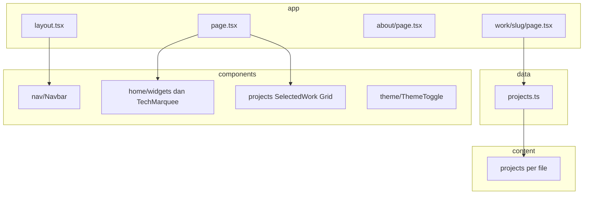

# Ringkasan portofolio Masbay — struktur proyek dan arah produk

Dokumen ini merangkum struktur codebase, stack teknis, alur halaman, sumber data, integrasi, dan positioning situs portofolio pribadi **M. Maulana Bayu (Masbay)**.

---

## 1. Ringkasan

- **Siapa**: Masbay — frontend developer, UI/UX designer, dan digital content creator (Padang).
- **Tujuan situs**: menampilkan identitas profesional, **selected work** dengan filter kategori, dan detail per proyek; nuansa personal lewat hero berbasis **widget** (status “sekarang”, foto, dan stack tools).
- **Bahasa & tone**: konten utama berbahasa **Indonesia**; HTML root memakai `lang="id"` (`app/layout.tsx`).
- **Referensi desain** (lihat juga `PROMT.md`): estetika mengacu ke **macfolio.com** — clean, minimal, kartu portofolio dengan transisi gambar hover, dukungan **dark/light**, metadata untuk SEO.

---

## 2. Stack dan tooling

| Area | Pilihan |
|------|---------|
| Framework | **Next.js 16** (App Router) |
| UI | **React 19**, **TypeScript** |
| Styling | **Tailwind CSS 4** (`@tailwindcss/postcss`) |
| Animasi | **Framer Motion** (`LazyMotion` + `domAnimation` di beberapa komponen) |
| Tema | **next-themes** (`ThemeProvider` di `app/providers.tsx`) |
| Font | **Geist** / **Geist Mono** via `next/font/google` |

**Catatan untuk kontributor / agen**: repo memuat pengingat di `AGENTS.md` — versi Next.js ini dapat berbeda dari dokumentasi umum; sebelum mengubah API Next.js, baca panduan di `node_modules/next/dist/docs/` dan perhatikan deprecation.

**Skrip npm** (`package.json`):

- `npm run dev` — server pengembangan
- `npm run build` — build produksi
- `npm run start` — jalankan build
- `npm run lint` — ESLint (`eslint-config-next`)

Deploy yang dikehendaki di brief proyek: **Vercel** (lihat `PROMT.md`).

---

## 3. Struktur direktori

| Folder / file | Peran |
|---------------|--------|
| `app/` | App Router: layout global, halaman, route API |
| `app/layout.tsx` | Shell HTML, font, metadata default, `Navbar`, wrapper `Providers`, kontainer `main` |
| `app/page.tsx` | Beranda: greeting, badge kolaborasi, hero widgets, selected work, marquee teknologi |
| `app/about/page.tsx` | Halaman tentang + daftar skill |
| `app/work/[slug]/page.tsx` | Detail proyek; `generateStaticParams` dari data `projects` |
| `app/globals.css` | Gaya global Tailwind v4 |
| `app/providers.tsx` | `ThemeProvider` (class, system default) |
| `components/nav/` | Navbar + link Work / About |
| `components/home/` | `AnimatedGreeting`, `TechMarquee`, folder `widgets/` |
| `components/home/widgets/` | Intro, stack, “now”, foto, shell, hero (static + client + drag) |
| `components/projects/` | Grid kartu, filter, selected work, tag, kartu proyek |
| `components/theme/` | Toggle tema |
| `content/projects/` | Satu file per proyek (`*.ts`, `video_vokasi.tsx`) — konten manual |
| `content/writing/posts/` | Satu file per artikel; `content/writing/categories.ts` untuk urutan kategori |
| `content/events/` | Satu file per kegiatan kalender |
| `content/home/` | Konten editorial beranda (mis. kartu stack scroll) |
| `data/projects.ts` | Aggregator `projects` — impor dari `content/projects/*` |
| `data/writing.ts` | Aggregator + helper (`getPostBySlug`, `sortedWritingPosts`, …) |
| `data/events.ts` | Aggregator + helper (`sortedEvents`, `getEventBySlug`) |
| `data/stack-scroll-cards.ts` | Re-export kartu beranda dari `content/home/` |
| `design-system/` | Token, icons, animasi, pola komponen runtime (`@/design-system`) |
| `lib/site.ts` | Konstanta situs: `name`, `title`, `description`, `url`, `twitter` |
| `types/` | Tipe bersama (`project`, `writing`, `event`, `stack-scroll-card`, …) |
| `docs/` | Dokumen non-runtime (`PROMT.md`, `DESIGN.md`, dokumen ini) |
| `public/` | Aset statis (gambar profil, SVG proyek, ikon, dll.) |
| `skills/` | **Bukan** bagian runtime situs — README panduan untuk agen/kontributor |
| `next.config.ts` | Mis. `images.remotePatterns` untuk CDN gambar |
| `eslint.config.mjs`, `postcss.config.mjs`, `tsconfig.json` | Konfigurasi tooling |

---

## 4. Alur halaman dan UX

### Navigasi global (`components/nav/Navbar.tsx`)

- **Masbay** → `/`
- **Work** → `/`
- **About** → `/about`
- **Theme toggle** — dark / light / system

### Beranda (`app/page.tsx`)

1. **Animated greeting** — salam dinamis.
2. Badge “Available for collaborations” + petunjuk “Drag widgets (desktop)”.
3. **Hero widgets** (`HeroWidgetsClient` → `HeroWidgetsStatic` hingga mounted, lalu `HeroWidgets`):
   - **Desktop (sm+)**: area dengan widget **dapat di-drag** (posisi disimpan di state), berisi intro, stack teknologi, proyek yang sedang difokuskan, dan foto.
   - **Mobile**: layout **grid vertikal** + animasi stagger Framer Motion (tanpa drag).
4. **Selected work** — judul section, filter kategori (`ProjectsFilter`), grid kartu (`ProjectsGrid`) dengan animasi transisi filter.
5. **Tech marquee** — deretan logo/teknologi.

### Detail proyek (`/work/[slug]`)

- Slug harus cocok dengan entri di `data/projects.ts`.
- Metadata OG/Twitter memakai judul, deskripsi, dan gambar proyek.
- Konten panjang, galeri opsional, case study opsional — sesuai field di tipe `Project`.

### About (`/about`)

- Foto profil, narasi singkat, link sosial, daftar skill.

---

## 5. Model data proyek

Definisi lengkap: `types/project.ts`.

**Ringkas field utama**

- `title`, `description`, `longDescription`
- `category`: `ProjectCategory` — `"All"` (hanya untuk filter UI), `"Design"`, `"Website"`, `"Tools"`, `"Video"`, `"App"`
- `tags[]`, `slug` (URL `/work/[slug]`)
- `href?`, `logo?`, `caseStudyHref?`, `externalLink?`, `externalLinkLabel?`
- `image` / `hoverImage` — `src`, `alt`, `width`, `height` (untuk `next/image`)
- `gallery?`, `caseStudy?` — struktur galeri tambahan

**Cara menambah proyek baru**

1. Buat file baru di `content/projects/` (mis. `nama-proyek.ts`) yang mengekspor objek memenuhi tipe `Project`.
2. Impor di `data/projects.ts` dan tambahkan ke array `projects` (urutan array mempengaruhi urutan tampilan / proyek “pertama” untuk widget “now” yang memakai `projects[0]`).

**File konten saat ini** (`content/projects/`)

- `auto-notion.ts`
- `video_vokasi.tsx`
- `itailwind.ts`

---

## 6. API dan environment

**URL situs** (metadata absolut): `NEXT_PUBLIC_SITE_URL` di `lib/site.ts` (fallback `http://localhost:3000` untuk lokal).

---

## 7. SEO dan metadata

- **Default global**: `app/layout.tsx` memakai `metadataBase` dari `site.url`, template judul `%s — ${site.name}`, deskripsi dari `lib/site.ts`, Open Graph dan Twitter card dasar.
- **Override halaman**:
  - `app/page.tsx` — deskripsi lebih kaya (peran triple: frontend / UI-UX / content creator).
  - `app/about/page.tsx` — judul “About” + deskripsi tentang.
  - `app/work/[slug]/page.tsx` — `generateMetadata` per slug: judul proyek, deskripsi singkat, gambar OG dari `project.image`.

Gunakan `next/image` untuk gambar lokal sesuai brief; domain remote sudah dikonfigurasi di `next.config.ts` untuk ikon CDN.

---

## 8. Perilaku teknis hero (hydration)

`HeroWidgetsClient` sengaja merender **`HeroWidgetsStatic` sampai `mounted`** di client agar HTML awal SSR sama dengan render pertama di client — menghindari **hydration mismatch** sebelum fitur drag / pengukuran viewport aktif. Setelah mount, tampilan interaktif `HeroWidgets` dipakai.

---

## 9. Dokumen terkait di repo

- `docs/PROMT.md` — brief asli: referensi macfolio, struktur halaman, identitas, catatan desain.
- `docs/DESIGN.md` — design tokens & komponen (Google design.md).
- `README.md` — template create-next-app (getting started generik); untuk gambaran proyek khusus portofolio, gunakan dokumen ini.
- `AGENTS.md` / `CLAUDE.md` — aturan agen / Next.js.

---

*Terakhir diselaraskan dengan struktur repo portofolio Masbay (Next.js App Router, data-driven projects).*
